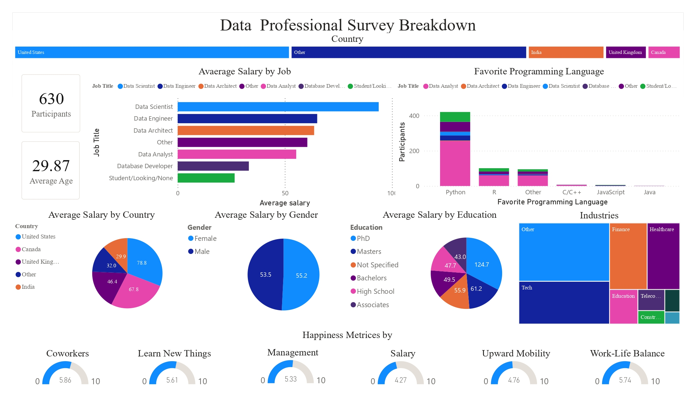

# 📊 Professional Work Survey Dashboard (Power BI)

## 📌 Project Overview
Proyek ini berisi *dashboard* analitis interaktif yang dibangun menggunakan **Power BI** untuk mengolah dan memvisualisasikan data hasil survei lingkungan kerja profesional. *Dashboard* ini dirancang untuk membantu divisi HR maupun manajemen dalam memahami dinamika tenaga kerja, kepuasan karyawan, dan faktor-faktor pendukung performa kerja.

**🛠️ Tools & Technologies:**
* **Visualisasi & Reporting:** Power BI Desktop
* **Data Transformation:** Power Query (ETL)
* **Calculations & Metrics:** DAX (Data Analysis Expressions)
* **Data Source:** Excel / CSV Dataset

---

## 🖼️ Dashboard Preview



---

## 💡 Key Business Insights
Berdasarkan hasil visualisasi dan analisis data survei:
1. **Work-Life Balance & Satisfaction:** Sebagian besar responden melaporkan tingkat kepuasan kerja di atas rata-rata ketika didukung oleh kebijakan jam kerja fleksibel.
2. **Demographic Distribution:** Distribusi responden berdasarkan jenjang karier dan divisi menunjukkan dominasi tingkat *mid-level professional*.
3. **Key Drivers:** Kompensasi dan budaya kerja menjadi dua variabel utama yang berpengaruh signifikan terhadap tingkat retensi karyawan.

---

## 📁 Repository Structure
```text
├── Dashboard Survey Profesional Work.pbix   # File proyek utama Power BI
├── dashboard_preview.png                    # Gambar tangkapan layar dashboard
├── dataset/                                 # Folder data mentah (CSV/Excel)
└── README.md                                # Dokumentasi proyek
